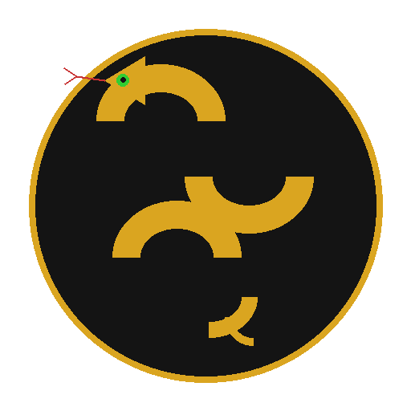

<p align="center">
  
</p>

<h1 align="center">🐍 BlackMamba Studio</h1>

<p align="center">
  <strong>The Future of Video Editing is Here</strong>
</p>

<p align="center">
  <em>AI-Powered • Professional Grade • Built for Creators</em>
</p>

<p align="center">
  <a href="https://github.com/Blackmvmba88/VIdeoEditor/releases">
    
  </a>
  <a href="LICENSE">
    
  </a>
  <a href="#">
    
  </a>
  <a href="#">
    
  </a>
</p>

<p align="center">
  <a href="#">
    
  </a>
  <a href="#">
    
  </a>
  <a href="#">
    
  </a>
</p>

<p align="center">
  <a href="ROADMAP.md">🗺️ Roadmap</a> •
  <a href="#-quick-start">🚀 Quick Start</a> •
  <a href="#-features">✨ Features</a> •
  <a href="#-keyboard-shortcuts">⌨️ Shortcuts</a> •
  <a href="https://github.com/Blackmvmba88/VIdeoEditor/issues">🐛 Report Bug</a>
</p>

---

<p align="center">
  
</p>

## 🎬 What is BlackMamba Studio?

**BlackMamba Studio** is a professional-grade video editor that combines the power of **AI automation** with **precision editing tools**. Built with Electron and powered by FFmpeg, it delivers a cinematic editing experience inspired by DaVinci Resolve.

> **🎯 Our Mission:** Save creators hours of editing time so they can focus on what matters most—their content and their families.

### 🌟 Why Choose BlackMamba?

| Feature | BlackMamba | Other Editors |
|---------|:----------:|:-------------:|
| AI Auto-Edit | ✅ Built-in | ❌ Plugin required |
| FFmpeg Native | ✅ Full integration | ⚠️ Limited |
| Cross-platform | ✅ Mac + Windows | ⚠️ Varies |
| Open Source | ✅ MIT License | ❌ Proprietary |
| Price | ✅ Free Forever | 💰 $300-$700/year |

---

## 🚀 Quick Start

### Prerequisites

- **Node.js** ≥ 18.0.0
- **FFmpeg** ≥ 6.0 (auto-detected)
- **npm** or **yarn**

### Installation

```bash
# Clone the repository
git clone https://github.com/Blackmvmba88/VIdeoEditor.git

# Navigate to directory
cd VIdeoEditor

# Install dependencies
npm install

# Start the app
npm start
```

### Build for Production

```bash
# macOS (Universal Binary)
npm run build:mac

# Windows (x64)
npm run build:win
```

---

## ✨ Features

### 🤖 AI Auto-Edit — *Your Personal Editor*

<table>
<tr>
<td width="60%">

**Let AI do the heavy lifting!**

BlackMamba's Auto-Edit feature analyzes your footage and automatically creates professional edits:

- 🎯 **Smart Scene Detection** — Finds the best moments
- 🔊 **Audio Peak Analysis** — Syncs with high-energy audio
- 🎬 **Multiple Styles** — Highlights, Summary, Action
- ⏱️ **Time Saved** — See your editing hours saved

</td>
<td width="40%">

```
┌─────────────────────────┐
│  🎥 Import Video        │
│           ↓             │
│  🔍 AI Analysis         │
│           ↓             │
│  ✂️ Smart Cuts          │
│           ↓             │
│  🎬 Final Export        │
└─────────────────────────┘
```

</td>
</tr>
</table>

---

### 📂 Project Management — *Stay Organized*

<table>
<tr>
<td width="50%">

**Full project lifecycle management:**

- 📁 **Create/Open/Save** projects
- 🔄 **Auto-save** every 30 seconds
- 📚 **Recent Projects** quick access
- 🔍 **Folder Scanning** — Import entire folders

</td>
<td width="50%">

**Supported Formats (25+):**

```
Video: mp4, mov, avi, mkv, webm, m4v,
       wmv, flv, 3gp, mpeg, ts, mts...

Audio: mp3, wav, aac, flac, ogg, m4a...

Image: jpg, png, gif, bmp, tiff, webp...
```

</td>
</tr>
</table>

---

### 🎨 Professional Tools

<table>
<tr>
<td width="33%">

#### 🎬 Video Editing
- Multi-track timeline
- Frame-accurate trimming
- Drag & drop reordering
- Speed ramping (0.1x - 100x)
- Transitions library

</td>
<td width="33%">

#### 🎨 Color Grading
- Color wheels (lift/gamma/gain)
- LUT support
- Scopes (waveform, vectorscope)
- Color matching
- HDR support

</td>
<td width="33%">

#### 🔊 Audio Processing
- Multi-channel mixing
- AI denoise
- Auto-EQ
- Volume normalization
- Beat sync

</td>
</tr>
</table>

---

### 🎭 Motion Graphics

<table>
<tr>
<td width="50%">

**Create stunning visuals:**

- 📛 **Lower Thirds** — Name tags, labels, prices
- ✨ **Animated Titles** — 20+ cinematic styles
- 😀 **Animated Emojis** — Expressive reactions
- 📱 **Social Banners** — Platform-optimized

</td>
<td width="50%">

**Supported Platforms:**

| Platform | Aspect | Resolution |
|----------|--------|------------|
| YouTube | 16:9 | 1920×1080 |
| TikTok | 9:16 | 1080×1920 |
| Instagram | 1:1 | 1080×1080 |
| Twitter | 16:9 | 1280×720 |

</td>
</tr>
</table>

---

### 🔌 Plugin System

```javascript
// Create your own plugins!
class MyPlugin extends PluginBase {
  constructor() {
    super({
      name: 'My Custom Effect',
      version: '1.0.0',
      author: 'You!'
    });
  }

  async process(video, options) {
    // Your magic here ✨
  }
}
```

---

## 📊 Export Presets

| Preset | Resolution | Bitrate | Use Case |
|--------|------------|---------|----------|
| 📺 **YouTube 4K** | 3840×2160 | 45 Mbps | High quality uploads |
| 📺 **YouTube 1080p** | 1920×1080 | 16 Mbps | Standard uploads |
| 📱 **TikTok** | 1080×1920 | 8 Mbps | Vertical videos |
| 📱 **Instagram Reels** | 1080×1920 | 6 Mbps | Stories & Reels |
| 🐦 **Twitter** | 1280×720 | 5 Mbps | Social sharing |
| 🎬 **ProRes** | Source | ~180 Mbps | Professional delivery |
| 🌐 **Web Optimized** | 1280×720 | 4 Mbps | Fast loading |

---

## ⌨️ Keyboard Shortcuts

<table>
<tr>
<td width="50%">

### Project
| Shortcut | Action |
|----------|--------|
| `⌘/Ctrl + N` | New Project |
| `⌘/Ctrl + O` | Open Project |
| `⌘/Ctrl + S` | Save Project |
| `⌘/Ctrl + I` | Import Files |
| `⌘/Ctrl + ⇧ + I` | Scan Folder |

</td>
<td width="50%">

### Playback
| Shortcut | Action |
|----------|--------|
| `Space` | Play/Pause |
| `J` | Reverse |
| `K` | Stop |
| `L` | Forward |
| `←/→` | Frame Step |

</td>
</tr>
</table>

---

## 🏗️ Architecture

```
BlackMamba Studio
├── 🖥️  Electron Main Process
│   ├── Window Management
│   ├── IPC Handlers (50+)
│   └── Module Initialization
│
├── 🎨  Renderer Process
│   ├── Cinematic UI
│   ├── Timeline Editor
│   └── Preview Engine
│
├── 📦  Core Modules
│   ├── FFmpegWrapper      — FFmpeg/FFprobe commands
│   ├── VideoProcessor     — Cut, join, reorder
│   ├── ContentAnalyzer    — Scene/audio detection
│   ├── AutoEditor         — AI-powered editing
│   ├── ExportPresets      — Platform presets
│   ├── ProjectManager     — Project persistence
│   └── CodecManager       — Codec detection (30+ codecs)
│
└── 🔧  Phase Modules (5 phases)
    ├── Phase 1: Performance & Tools
    ├── Phase 2: AI Features
    ├── Phase 3: Motion Graphics & Audio
    ├── Phase 4: Plugins & Cloud
    └── Phase 5: AI Studio & Marketplace
```

---

## 🧪 Testing

```bash
# Run all tests (559 tests)
npm test

# Run with coverage
npm run test:coverage

# Run specific test file
npm test -- --testPathPattern=projectManager
```

**Current Stats:**
- ✅ **559 tests** passing
- 📊 **16 test suites**
- ⏱️ ~22s execution time

---

## 🛠️ Development

### Scripts

| Command | Description |
|---------|-------------|
| `npm start` | Run Electron app |
| `npm run web` | Run web server (port 3000) |
| `npm test` | Run Jest tests |
| `npm run lint` | ESLint check |
| `npm run lint:fix` | Auto-fix lint issues |
| `npm run build:mac` | Build macOS DMG |
| `npm run build:win` | Build Windows EXE |

### Module Structure

```bash
src/modules/
├── Core Modules (10)
│   ├── ffmpegWrapper.js
│   ├── videoProcessor.js
│   ├── contentAnalyzer.js
│   ├── autoEditor.js
│   ├── exportPresets.js
│   ├── exportRenderer.js
│   ├── fileValidator.js
│   ├── formatDetector.js
│   ├── projectManager.js    # NEW
│   └── codecManager.js      # NEW
│
├── BMIC Intelligence System
│   ├── bmic.js              # Master decision engine
│   ├── optimizer.js         # FFmpeg pipeline
│   └── autoImprove.js       # Post-process analysis
│
└── phases/                  # 60+ modules
    ├── phase1/              # Performance
    ├── phase2/              # AI
    ├── phase3/              # Motion Graphics
    ├── phase4/              # Plugins & Cloud
    └── phase5/              # AI Studio
```

---

## 🤝 Contributing

We love contributions! Here's how you can help:

1. 🍴 **Fork** the repository
2. 🌿 **Create** a feature branch (`git checkout -b feature/amazing`)
3. 💻 **Commit** your changes (`git commit -m '✨ Add amazing feature'`)
4. 📤 **Push** to branch (`git push origin feature/amazing`)
5. 🎉 **Open** a Pull Request

### Commit Convention

```
✨ feat: Add new feature
🐛 fix: Bug fix
📝 docs: Documentation
🎨 style: Formatting
♻️ refactor: Code refactoring
🧪 test: Add tests
🔧 chore: Maintenance
```

---

## 📄 License

**MIT License** — Free forever for personal and commercial use.

```
Copyright (c) 2025 BlackMamba Studio

Permission is hereby granted, free of charge, to any person obtaining a copy
of this software and associated documentation files (the "Software"), to deal
in the Software without restriction, including without limitation the rights
to use, copy, modify, merge, publish, distribute, sublicense, and/or sell
copies of the Software.
```

---

## 🙏 Acknowledgments

- **FFmpeg** — The backbone of video processing
- **Electron** — Cross-platform desktop apps
- **Node.js** — JavaScript runtime
- **Jest** — Testing framework
- **The Open Source Community** — For inspiration and tools

---

<p align="center">
  
</p>

<p align="center">
  <strong>Made with 🖤 by BlackMamba</strong>
</p>

<p align="center">
  <em>"Edit like a pro. Save time. Enjoy life."</em>
</p>

<p align="center">
  <a href="https://github.com/Blackmvmba88/VIdeoEditor">
    
  </a>
</p>
